# 🎱 Bingo Live — 90-Ball Multiplayer Bingo Caller & Player Sheet

[](https://kotlinlang.org/docs/multiplatform.html)
[](https://www.jetbrains.com/lp/compose-multiplatform/)
[](https://ktor.io/)
[](https://developer.android.com/)
[](https://developer.apple.com/ios/)
[](LICENSE)

A modern, real-time multiplayer 90-Ball Bingo (Tambola / Housie) app designed for Android and iOS using **Compose Multiplatform**. Features an embedded local **Ktor WebSocket server** hosted directly on the caller device, peer-to-peer **QR code room joining**, live real-time number broadcasting, and interactive player answer sheets with authoritative server-side win validation.

---

## 📸 Stitch UI Design & Screen Gallery

> **Stitch Project Title**: Bingo Number Caller UI  
> **Stitch Project ID**: `3967555042712264858`  
> Complete HTML code exports are saved in [`docs/stitch_html/`](./docs/stitch_html) and screenshots in [`docs/images/`](./docs/images).

### 1. Host Caller Console & Server Setup

| 01. New Game Confirmation | 02. Host Main Screen | 08. Host Server Lobby |
| :---: | :---: | :---: |
| 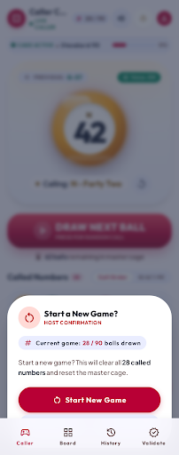 | 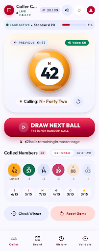 | 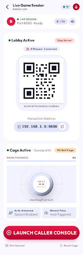 |
| **Confirmation Dialog**<br/>`ID: 42cddc0a536847559fd8dc2c057d130e`<br/>[View HTML Source](docs/stitch_html/01_caller_new_game_dialog.html) | **Bingo Caller Console**<br/>`ID: 5e16cba52e604c899bd39705c8b7aafd`<br/>[View HTML Source](docs/stitch_html/02_caller_main_screen.html) | **Lobby & QR Broadcast**<br/>`ID: 04045341dc4e4c2eb9358d3aac9c13aa`<br/>[View HTML Source](docs/stitch_html/08_host_lobby_server.html) |

---

### 2. Player Experience & Scan to Join

| 07. Player Scan to Join UI | 03. Launcher & Mode Select | 09. Launcher Redesign |
| :---: | :---: | :---: |
| 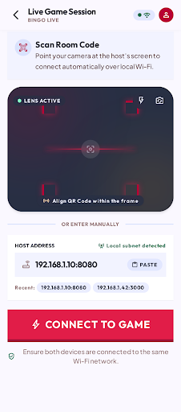 | 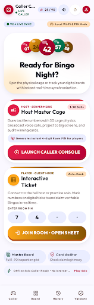 | 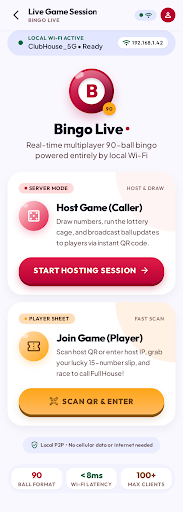 |
| **Scan to Join Screen**<br/>`ID: bc2181e0c060468eba5d343fe76ddf37`<br/>[View HTML Source](docs/stitch_html/07_player_scan_to_join.html) | **Mode Selection**<br/>`ID: 051e4ce50ec44fcdbd7dc7a4fe917d21`<br/>[View HTML Source](docs/stitch_html/03_launcher_mode_selection.html) | **Live Launcher**<br/>`ID: 7520591d185c43abacec72e3a6ce2d0c`<br/>[View HTML Source](docs/stitch_html/09_launcher_redesign.html) |

---

### 3. Live Physical Device Captures

| 04. Device Launcher | 05. Live QR Lobby Server | 06. Live Camera Scanner |
| :---: | :---: | :---: |
| 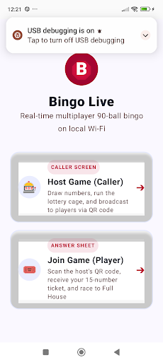 | 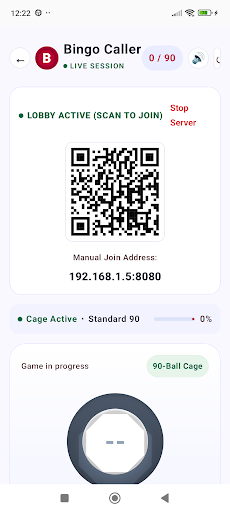 | 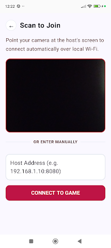 |
| **Live Launcher Screen**<br/>`ID: 15258087562557614059` | **Live Host Session & QR Code**<br/>`ID: 15258087562557612989` | **Scanner & Manual Connect**<br/>`ID: 15258087562557616015` |

---

## 🌟 Key Features

- **📶 100% Offline Local Wi-Fi Multiplayer**:
  - The host device automatically runs an embedded Ktor WebSocket server (`0.0.0.0:8080`).
  - No cloud server, cellular data, or internet connection required. Operates over local home Wi-Fi or mobile hotspot with `< 8ms` real-time latency.
- **📷 Instant QR Code Pairing**:
  - Host renders a high-contrast QR code generated in Kotlin Multiplatform with automatic fallback to manual IP entry (`192.168.x.x:8080`).
  - Players scan the QR code with their mobile camera via MLKit and connect immediately.
- **🎲 Host Master Cage & 90-Ball Caller**:
  - Tactile ball draw animations with UK Bingo letter prefixes (`B 1-15`, `I 16-30`, `N 31-45`, `G 46-60`, `O 61-75`, `76-90`).
  - Running history strip of called balls in reverse chronological order.
  - Safe reset modal to prevent accidental game loss.
- **🎫 Authentic Interactive Player Sheet**:
  - Standard UK 90-ball 3×9 bingo ticket (5 numbers & 4 blanks per row, 15 total numbers).
  - **No Spoilers / Anti-Giveaway**: Drawn numbers are **not** highlighted on the ticket, preserving the authentic bingo tension where players must pay attention.
  - **Manual Daubing**: Players tap called numbers to mark them. Tapping uncalled numbers is safely rejected with alert feedback (*"Number X hasn't been called yet!"*).
  - **Uncompromised Legibility**: Centered 15sp extra bold numbers remain 100% visible even after checking, with an elegant corner check badge.
- **🏆 Authoritative Full House Validation**:
  - The server authoritatively validates all 15 ticket numbers against its called list before declaring a winner.
  - Prevents fraudulent claims and broadcasts the winner to all connected players simultaneously.

---

## 🏗 Architecture & Project Structure

The project is structured as a modular Kotlin Multiplatform workspace:

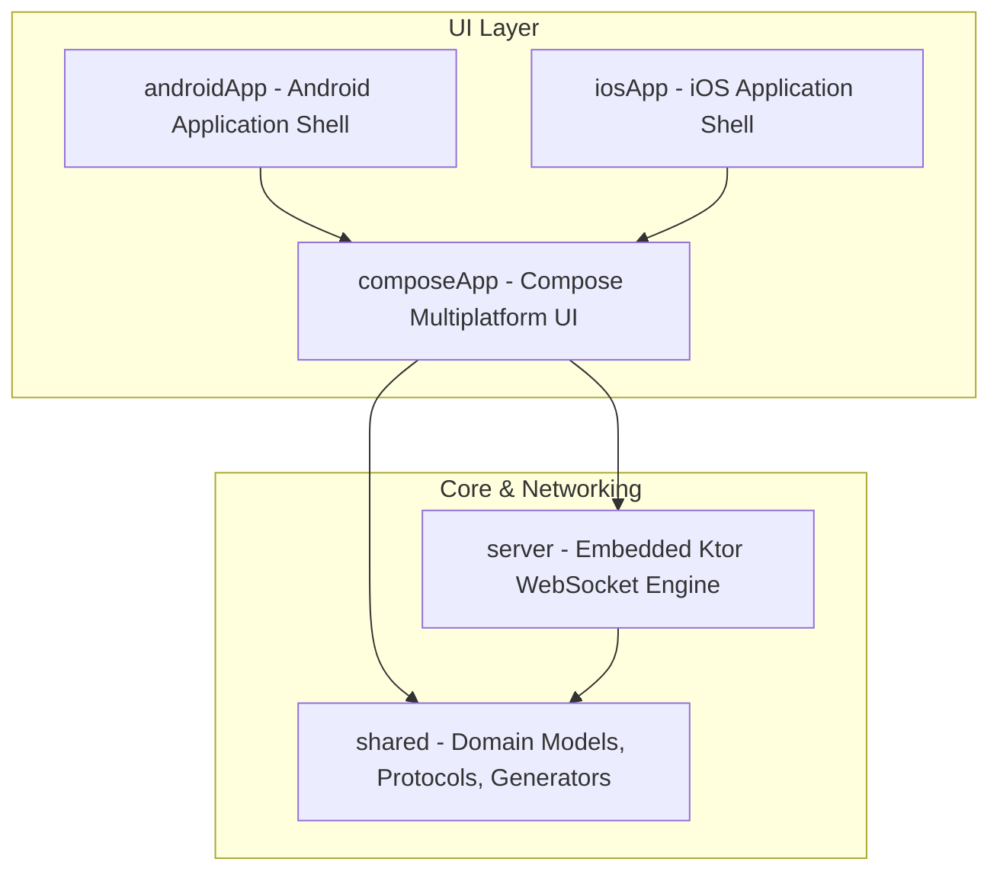

### Module Breakdown

| Module | Responsibility |
| :--- | :--- |
| [`composeApp`](./composeApp) | Shared Compose Multiplatform UI, ViewModels, navigation, and screen components (Caller, Scanner, Player Answer Sheet). |
| [`server`](./server) | Embedded Ktor WebSocket server running directly on the host's phone, handling connection management, message routing, and win validation. |
| [`shared`](./shared) | Pure Kotlin Multiplatform domain logic: `TicketGenerator`, `QrCodeGenerator`, `ConnectionInfo`, and JSON protocol `ClientMessage`/`ServerMessage`. |
| [`androidApp`](./androidApp) | Android target configuration, MLKit barcode scanner implementation, and native camera bindings. |
| [`iosApp`](./iosApp) | iOS native project wrapper launching the shared Compose controller. |

---

## 🔄 Real-Time Game Flow

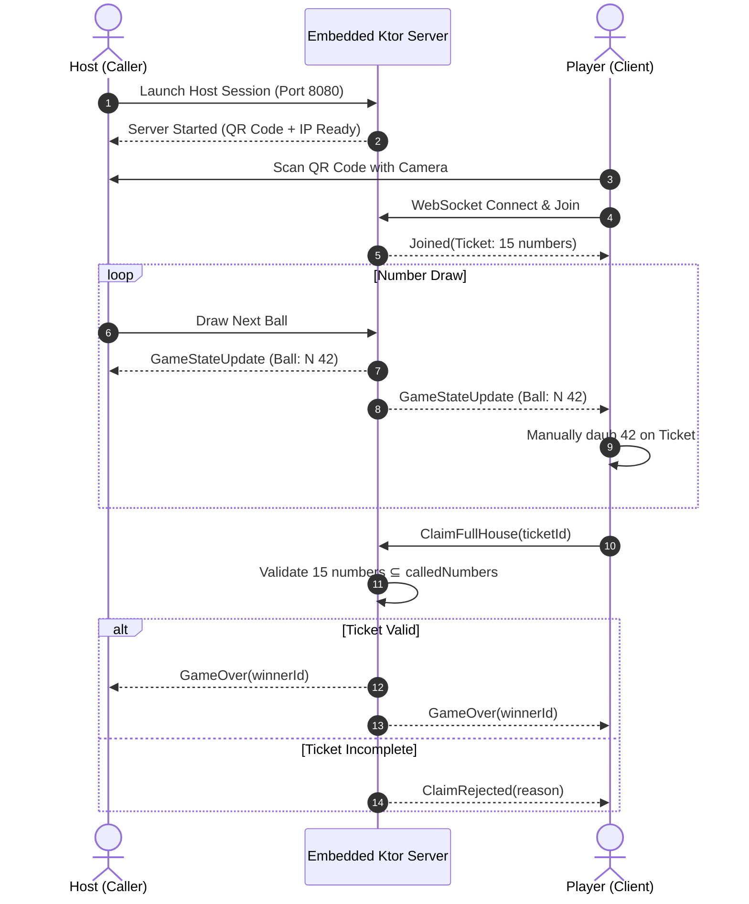

---

## 🚀 Building & Running

### Prerequisites

- **JDK 17** or higher
- **Android Studio** (Koala / Ladybug or newer with Compose Multiplatform plugin)
- **Xcode 15+** (for iOS compilation)

### Run Unit Tests

Execute the automated test suite covering game engines, ticket generators, QR decoders, and view models:

```bash
# Run tests for shared logic and Compose App
./gradlew :composeApp:allTests :shared:allTests
```

### Build Android APK

```bash
# Build debug APK for Android
./gradlew :androidApp:assembleDebug

# The APK will be generated at:
# androidApp/build/outputs/apk/debug/androidApp-debug.apk
```

### Build iOS

Open the [`iosApp`](./iosApp) folder in Xcode:

```bash
open iosApp/iosApp.xcworkspace
```

Select your simulator or physical device and click **Run**.

---

## 📋 Stitch Screens Catalog

| # | Screen Name | Screen ID | Type | Artifacts |
| :-: | :--- | :--- | :-: | :--- |
| 1 | **Bingo Caller - New Game Confirmation Dialog** | `42cddc0a536847559fd8dc2c057d130e` | Design | [Image](docs/images/01_caller_new_game_dialog.png) • [HTML](docs/stitch_html/01_caller_new_game_dialog.html) |
| 2 | **Bingo Caller - Main Screen** | `5e16cba52e604c899bd39705c8b7aafd` | Design | [Image](docs/images/02_caller_main_screen.png) • [HTML](docs/stitch_html/02_caller_main_screen.html) |
| 3 | **Bingo - Launcher & Mode Selection** | `051e4ce50ec44fcdbd7dc7a4fe917d21` | Design | [Image](docs/images/03_launcher_mode_selection.png) • [HTML](docs/stitch_html/03_launcher_mode_selection.html) |
| 4 | **Bingo Live - Real Device Launcher** | `15258087562557614059` | Device Capture | [Image](docs/images/04_device_launcher.png) |
| 5 | **Bingo Host - QR Lobby & Server Screen** | `15258087562557612989` | Device Capture | [Image](docs/images/05_device_host_qr_lobby.png) |
| 6 | **Bingo Player - Scan to Join** | `15258087562557616015` | Device Capture | [Image](docs/images/06_device_player_scanner.png) |
| 7 | **Bingo Player - Scan to Join Design** | `bc2181e0c060468eba5d343fe76ddf37` | Design | [Image](docs/images/07_player_scan_to_join.png) • [HTML](docs/stitch_html/07_player_scan_to_join.html) |
| 8 | **Bingo Host - Lobby & Server Screen Design** | `04045341dc4e4c2eb9358d3aac9c13aa` | Design | [Image](docs/images/08_host_lobby_server.png) • [HTML](docs/stitch_html/08_host_lobby_server.html) |
| 9 | **Bingo Live - Launcher Redesign** | `7520591d185c43abacec72e3a6ce2d0c` | Design | [Image](docs/images/09_launcher_redesign.png) • [HTML](docs/stitch_html/09_launcher_redesign.html) |

---

## 📄 License

This project is open-source under the [MIT License](LICENSE).